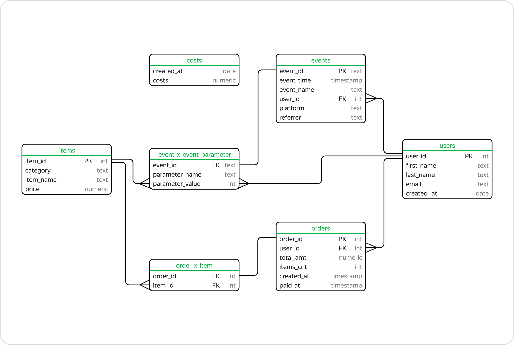

# Примеры SQL запросов

## Настройки

В модуле `settings/db_config.py` добавить настройки:  
`USER` – имя пользователя  
`PWD`&nbsp;&nbsp; – пароль  
`HOST` – хост  
`PORT` – порт подключения  
`DB` &nbsp;&nbsp;&nbsp; – название базы данных

## Цель проектов

Продемонстрировать уровень владения языком SQL

## Данные 

*Схема базы данных интернет-магазина.*

## business_metrics – расчёт бизнес-метрик таких как LTV, Conversion, ARPPU, ROI
## windows_examples – содержит примеры оконных функций
